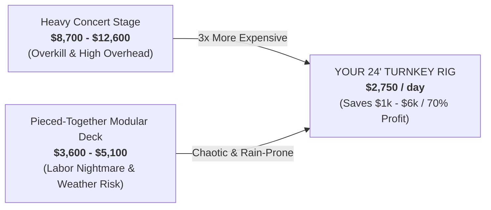
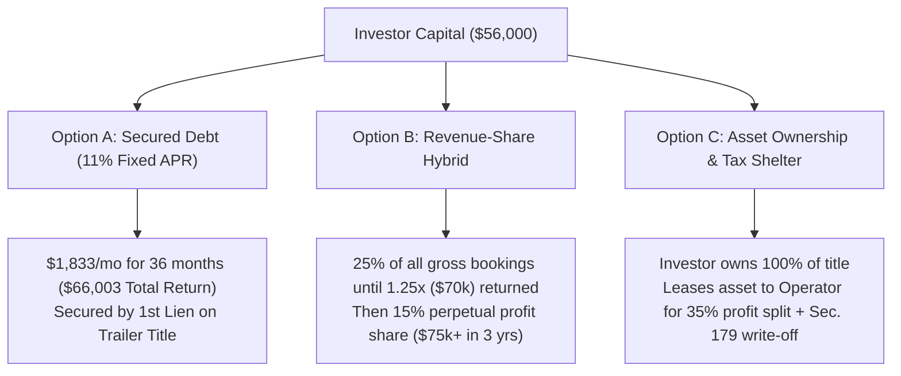

# Mobile Stage & Experiential Event Rig — Business Plan & Investor Memorandum

**Confidential Investment Offering & Operational Blueprint**
- **Target Asset**: SLE 8.5' × 24' Custom Blackout Mobile Stage Trailer
- **SKU / Model**: `CustStage-34619`
- **Official Dealer Listing URL**: [SLE Equipment - 8.5x24 Black Stage Trailer 34619](https://sleequipment.com/products/8-5x24-black-stage-trailer-34619?variant=52880231661749)
- **Base Trailer Purchase Price**: $34,999.00
- **Outfitting & Turnkey Production Budget**: $21,001.00 (Taxes, Audio/Lighting Rigging, Dual Stairs, Generator, Reserve)
- **Total Initial Capitalization Ask**: **$56,000.00**
- **Primary Tow Platform**: 2015 GMC Yukon XL (Class IV WDH + Electric Brake Controller)  

---

## 1. Executive Summary

### 1.1 The Venture
This venture provides **turnkey mobile stage, audio/visual production, and complete outdoor event staging rentals** for festivals, municipal concert series, sporting endurance events (5K/10K marathons), corporate brand activations, and private venue celebrations.

### 1.2 The Asset & Competitive Edge (`SKU: CustStage-34619`)
Unlike traditional festival staging companies that deploy cumbersome, open-frame hydraulic stages requiring commercial semi-trucks and multi-person rigging crews, our operation deploys an **all-blackout 8.5' × 24' enclosed stage trailer** featuring:
* **Electric Motorized Winch Deployment**: 1-person, 20-minute setup for the 16-foot stage deck and rear ramp loading system.
* **18' Armless Lateral Power Awning**: Zero vertical or diagonal poles blocking spectator or sponsor sightlines.
* **Deck-Over Flat Floor**: 100% flat floor plan with zero internal wheel-well intrusions and 8-foot extra tall headroom.
* **Insulated Commercial Interior**: Fully insulated white wipe-down commercial interior walls & ceiling with RTP coin rubber flooring, 100A panel, and a 36" RV door with integrated screen.
* **Turnkey Audiovisual Rig**: Integrated QSC concert PA sound, 65" high-nit 4K video display, stage LED wash lighting, and a 9.5kW ultra-quiet inverter generator.

### 1.3 The Investment Opportunity
* **Total Capitalization**: **\$56,000** *(All state/local sales taxes, title fees, and registration included)*
* **Projected Year 1 Gross Revenue**: **\$74,200** *(28 rental days @ \$2,650 avg ticket)*
* **Projected Year 1 Net Operating Income**: **\$51,800**
* **CapEx Payback Period**: **20 Rental Days** (~6 to 8 months)
* **Year 1 Cash-on-Cash Return (Asset Level)**: **92.5%**

---

## 2. Competitive Market Comps & Itemized Cost Analysis

### 2.1 The "Missing Middle" Market Gap
Event organizers currently face a broken, polarized market when procuring staging and AV:

### 2.2 Itemized Line-Item Comparison Matrix (Organizer Invoice Breakdown)

| Expense Line Item | Option 1: Heavy Hydraulic Stage *(Stageline SL100 / Large AV House)* | Option 2: Pieced-Together Rental *(Party Rental Decks + Separate AV)* | Option 3: YOUR Turnkey Rig *(SLE 24' Blackout Stage `SKU 34619`)* |
| :--- | :--- | :--- | :--- |
| **Stage & Roofing System** | **\$3,500 – \$4,200** *(Hydraulic metal stage)* | **\$850 – \$1,100** *(10x 4'x8' plywood Bil-Jax panels)* | **INCLUDED** *(16' stage + 18' armless awning)* |
| **Canopy / Weather Cover** | *Included in heavy roof* | **\$750 – \$1,200** *(20'x20' frame tent over stage)* | **INCLUDED** *(18' power lateral awning)* |
| **Safety Railings & Stairs** | **\$250 – \$400** | **\$250 – \$350** | **INCLUDED** *(Black railings + dual stairs)* |
| **Concert Sound System (PA)** | **\$2,000 – \$3,500** *(Line array or large PA)* | **\$800 – \$1,400** *(Rented from AV shop/music store)* | **INCLUDED** *(Dual QSC K12.2 tops + KS118 sub)* |
| **Digital Video / TV Display** | **\$1,500 – \$2,500** *(Separate LED wall trailer)* | **NOT AVAILABLE** *(No mount on bare stage)* | **INCLUDED** *(65" 4K smart display screen)* |
| **Power Generation** | **\$600 – \$900** *(Tow-behind industrial gen)* | **\$350 – \$500** *(Sunbelt/Home Depot generator)* | **INCLUDED** *(Predator 9.5kW quiet inverter)* |
| **Backstage Gear & Tech Cabin** | **\$1,200 – \$1,800** *(Side tent / gear pod)* | **NOT AVAILABLE** *(Performers sit in cars)* | **INCLUDED** *(Insulated Enclosed Cabin)* |
| **Delivery, Rigging & Labor** | **\$800 – \$1,500** *(3–4 CDL techs / 3 hrs setup)* | **\$600 – \$900** *(4-man crew / 4 hrs manual build)* | **INCLUDED** *(1-man 20-min motorized setup)* |
| **TOTAL ORGANIZER COST** | **\$8,700 – \$12,600** | **\$3,600 – \$5,100** | **\$2,750 / DAY** |
| **Setup Time & Risk** | 2–3 Hours (Needs semi truck) | 4+ Hours (Plywood ruined if it rains) | **20 Minutes (Motorized Winches)** |

---

## 3. Capital Expenditure & Initial Outfitting Budget (With Taxes)

| Category | Item Description | Base Price | Sales Tax & Title Fees | Total Out-of-Pocket |
| :--- | :--- | :--- | :--- | :--- |
| **Primary Asset** | **SLE 8.5' × 24' Blackout Stage Trailer (`SKU: 34619`)** *Deck-over, motorized stage/ramp winches, 18' armless awning, RTP floor, white interior, 100A panel, black mag wheels* | \$37,599.00 | • \$2,720.00 *(State & Local Vehicle Tax)* • \$350.00 *(Title, Tag & Doc Fees)* | **\$40,669.00** |
| **Climate Control** | Dometic 15,000 BTU Low-Profile Rooftop A/C Unit with Heat Strip (Installed) | \$1,850.00 | \$171.13 *(9.25% Equipment Tax)* | **\$2,021.13** |
| **Concert Audio Rig** | (2) QSC K12.2 Powered Tops + (1) QSC KS118 3600W Subwoofer + Shure Wireless Mics + Digital Mixer + Pro Stands | \$5,780.00 | \$534.65 *(9.25% Equipment Tax)* | **\$6,314.65** |
| **Video & Digital Wall** | 65" High-Nit Outdoor 4K Screen + Heavy-Duty RV Locking Articulating Wall Mount + Wireless HDMI | \$1,250.00 | \$115.63 *(9.25% Equipment Tax)* | **\$1,365.63** |
| **Off-Grid Power** | Predator 9500W Super-Quiet Inverter Generator (50A RV Twist-Lock Shore Output) | \$2,399.00 | \$221.91 *(9.25% Equipment Tax)* | **\$2,620.91** |
| **Towing & Safety Rig** | Class IV Weight Distribution Hitch (WDH) + Sway Control + Wheel Chocks + Leveling Pads + 50A Shore Cable | \$1,122.00 | \$103.79 *(9.25% Equipment Tax)* | **\$1,225.79** |
| **Working Capital** | Initial insurance down-payment, spare tire, ratchet straps & launch buffer | \$1,782.89 | — | **\$1,782.89** |
| **Total All-In CapEx** | **Turnkey Operational Staging Rig (All Taxes & Fees Included)** | **\$51,782.89** | **\$4,217.11** | **\$56,000.00** |

---

## 4. Three-Year Scaled Pro Forma Model & Employee Staffing Strategy

### 4.1 Pricing Matrix
* **Tier 1: Dry Stage Rental**: **\$1,450 / day** *(Stage + 18' Armless Awning + 100A Panel; Client provides AV)*
* **Tier 2: Turnkey Live Production**: **\$2,750 / day** *(Stage + Awning + QSC PA Sound + Stage Lighting + 50A Gen)*
* **Tier 3: Corporate VIP / Brand Activation**: **\$4,500 / day** *(Stage + 65" 4K TV + Full QSC PA + Lighting + On-Site Tech & Logistics)*

### 4.2 3-Year Fleet Expansion & Scaled Staffing Roadmap
* **Year 1 (1 Rig / 32 Events — \$88,000 Gross / \$66,000 NOI)**: 
  * *Fleet*: Initial 2026 SLE 8.5' × 24' Blackout Stage (`SKU 34619`).
  * *Team*: Founder-Operator (Sales, towing, setup) + Part-time 1099 Setup Techs (\$250/event × 32 events = \$8,000).
  * *Fleet Reinvestment*: Retains \$20,000+ cash flow to fund equity down-payment and reserve buffer for Trailer #2.
* **Year 2 (2 Rigs / 72 Events — \$205,200 Gross / \$102,000 NOI)**: 
  * *Fleet*: 2 Complete Stage Trailer Rigs (Second unit acquired via retained earnings + commercial equipment financing).
  * *Team*: 1 Full-Time Lead Rig Driver & Audio Engineer (\$48,000 base + bonuses) + 2 On-Call 1099 Setup Techs (\$17,500 pool).
  * *Founder Focus*: Transitions 100% to municipal contracts, festival promoter relationships, and regional expansion.
* **Year 3 (3-Rig Fleet / 135 Events — \$405,000 Gross / \$155,000 NOI)**: 
  * *Fleet*: 3 Complete Stage Trailer Rigs covering concurrent regional festivals, municipal tours, and corporate pop-ups.
  * *Team*: 1 General Operations & Logistics Manager (\$55,000), 2 Full-Time Lead Drivers / Audio Technicians (\$48,000 each = \$96,000), and 4 On-Call Staging Crew Members (\$27,000 seasonal pool).
  * *Autonomous Operations*: Enterprise operates hands-off, providing high-yield, passive cash distributions to equity and debt partners.

### 4.3 3-Year Income Statement Projections (+1 Trailer / Year)

| Financial & Fleet Line Item | Year 1 (1 Rig / Launch) | Year 2 (2 Rigs / Scale) | Year 3 (3-Rig Fleet Team) |
| :--- | :--- | :--- | :--- |
| **Total Active Fleet Rigs &bull; Booked Days** | **1 Rig &bull; 32 Days** | **2 Rigs &bull; 72 Days** | **3 Rigs &bull; 135 Days** |
| **Average Realized Ticket per Event** | \$2,750 | \$2,850 | \$3,000 |
| **GROSS RENTAL REVENUE** | **\$88,000** | **\$205,200** | **\$405,000** |
| *Staffing & Crew Payroll* | (\$8,000) | (\$65,500) | (\$178,000) |
| *Direct Fuel & Transport Logistics* | (\$3,840) | (\$8,640) | (\$16,200) |
| *Commercial Liability & Fleet Insurance* | (\$3,600) | (\$7,200) | (\$10,800) |
| *Storage Facility, Software & Consumables* | (\$3,600) | (\$7,860) | (\$15,000) |
| *Maintenance Reserve & Equipment Fund* | (\$2,960) | (\$14,000) | (\$30,000) |
| **Total Operating Expenses (OpEx)** | **(\$22,000)** | **(\$103,200)** | **(\$250,000)** |
| **Net Operating Income (NOI / Free Cash Flow)** | **\$66,000** | **\$102,000** | **\$155,000** |
| **Net Operating Profit Margin** | **75.0%** | **49.7%** *(2 Rigs)* | **38.3%** *(3-Rig Autonomous Fleet)* |
| **Asset Payback Window on Initial \$56k Seed** | **20 Rental Days** | — | — |

---

## 5. Investor Deal Structures (3 Back-Up Options)

### Option A: Asset-Backed Secured Promissory Note (Fixed Return)
* **Structure**: \$56,000 36-Month Senior Secured Note @ **11.0% APR**.
* **Collateral**: First-priority title lien on the 2026 SLE 24' Stage Trailer + equipment.
* **Monthly Debt Service**: **\$1,833 / month** (\$22,001 / year).
* **Total Payout to Investor**: **\$66,003** (\$10,003 interest profit).

### Option B: Revenue-Share Hybrid (Growth & High Cash Velocity)
* **Structure**: Investor receives **25% of all Gross Rental Revenue** until **\$70,000 (1.25x MOIC)** is paid back (~Month 15).
* **Post-Payback Royalty**: Once the initial capital + 25% return is achieved, the investor receives a perpetual **15% Net Cash Flow dividend**.
* **3-Year Total Cash Returned**: **\$75,250 (34.4% Net ROI)**.

### Option C: Equipment Sale-Leaseback / Asset Ownership (Depreciation Tax Shelter)
* **Structure**: Investor purchases the trailer directly and retains 100% legal title (allowing the investor to claim **Section 179 / Bonus Depreciation** tax write-offs).
* **Operating Agreement**: Investor leases the asset exclusively to the Operating Company for a **35% share of all net operating profits** (\$18k–\$32k/yr).

---

## 6. Operations, Towing & Risk Safeguards
* **Tow Vehicle**: 2015 GMC Yukon XL (5.3L V8, 8,300 lbs towing capacity / 1,000 lbs tongue weight).
* **Safety Rigging**: Class IV Weight Distribution Hitch with dual integrated sway control bars & digital brake controller.
* **1-Person Setup**: Motorized winches for stage deck and ramp deployment; leveling completed in 20 minutes with 4-corner drop jacks.
* **Insurance**: \$1M/\$2M Commercial General Liability + Inland Marine comprehensive theft/damage coverage.
